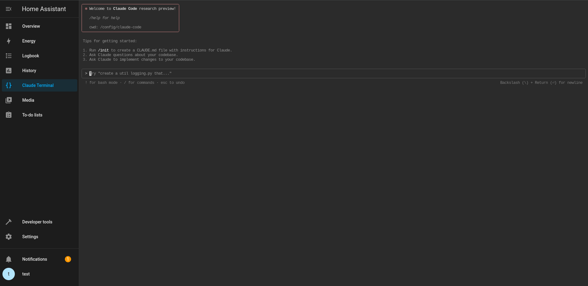

# Claude Terminal Pro

A web-based terminal with Anthropic's Claude Code CLI pre-installed, running directly inside your Home Assistant dashboard.



## What it does

Claude Terminal Pro gives you Claude Code — Anthropic's AI coding assistant — in a browser terminal with direct access to your Home Assistant `/config`. Use it to write and debug automations, fix YAML, manage entities, or develop custom components, all from the dashboard.

It adds persistent authentication, persistent package management, image paste, and an optional self-updating Claude Code on top of a standard terminal add-on.

## Quick start

The terminal launches Claude automatically when you open it:

```bash
# Ask a single question
claude "write an automation that turns on lights when motion is detected after sunset"

# Start an interactive session
claude

# See all options
claude --help
```

The terminal opens in `/config`, so Claude can read and edit your Home Assistant files directly.

## Installation

1. **Settings → Add-ons → Add-on Store**
2. Three-dots menu (⋮) → **Repositories** → add `https://github.com/sarpel/claude-code-ha`
3. Install **Claude Terminal Pro** and start it
4. Open the Web UI and complete the OAuth sign-in on first use

## Configuration

All options are optional; the add-on works out of the box.

| Option | Default | Description |
| --- | --- | --- |
| `auto_launch_claude` | `true` | Auto-start Claude, or show the session picker when `false` |
| `dangerously_skip_permissions` | `false` | Run Claude with unrestricted file access |
| `persistent_apk_packages` | `[]` | APK packages to auto-install on startup |
| `persistent_pip_packages` | `[]` | Python packages to auto-install on startup |
| `use_persistent_claude` | `false` | Use a self-updating Claude Code install kept in `/data/home/.local/bin` |
| `auto_update_claude_on_start` | `false` | With `use_persistent_claude`, fetch the channel on each startup |
| `claude_channel` | `latest` | `latest` or `stable` for the persistent override |

See [DOCS.md](DOCS.md) for full details and examples.

## How it works

- **Web UI / terminal** — port `7680` serves the web interface (image upload + embedded terminal) over Home Assistant ingress; `ttyd` runs the terminal on `7681` behind it.
- **Persistence** — everything that must survive restarts lives under `/data`: OAuth credentials (`/data/.config/claude`), installed packages (`/data/packages`), uploaded images (`/data/images`), and the optional Claude override (`/data/home/.local/bin`).
- **Pre-installed tools** — `git`, `gh` (GitHub CLI), `ha` (Home Assistant CLI), Python 3, and the `persist-install` helper.

## Installing packages

Use `persist-install` so packages survive restarts (plain `apk add`/`pip install` are lost on restart):

```bash
persist-install git vim htop          # APK packages
persist-install --python requests pandas
persist-install --list
```

See [PERSISTENT_PACKAGES.md](PERSISTENT_PACKAGES.md).

## Troubleshooting

```bash
claude doctor        # check installation and version
claude --version     # confirm the running version
```

- If the terminal disconnects, refresh the page (it auto-reconnects).
- Check the add-on **Logs** tab for startup details.
- Credentials persist across restarts; you should not need to re-authenticate.

## License

MIT — see [LICENSE](../LICENSE).
